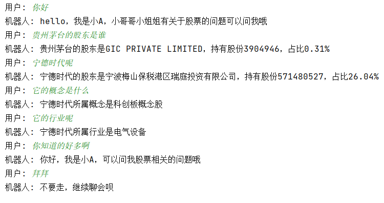
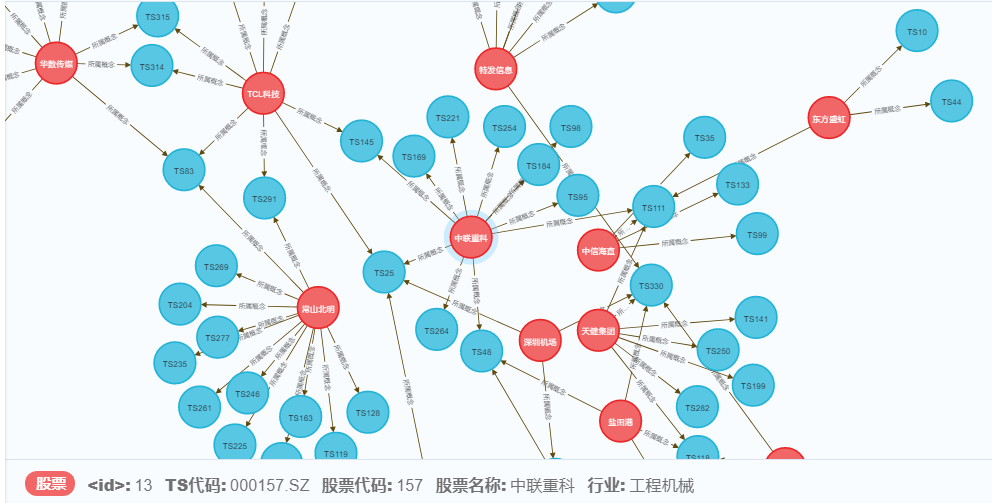
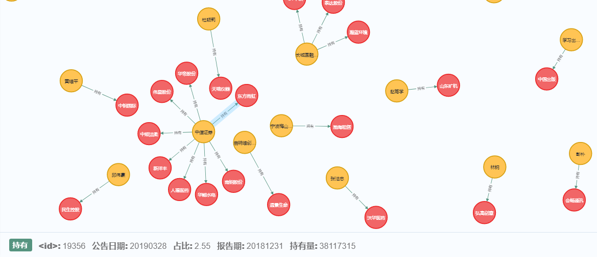
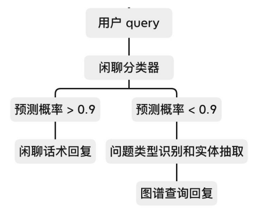

# 基于金融知识图谱的问答系统

下图示例展示了具体问答的过程，问答系统支持简单的查询股东、概念、所属行业等查询，同时支持简单的多轮对话功能和闲聊功能



所属概念图



持股图



## 1.准备数据
利用结构化三元组构建金融知识图谱，数据可在[此处](https://pan.baidu.com/s/1UQfu5c1Y7BfdMS_uNGrZug )下载获得，提取码：`sae3`

下载后将压缩包解压，并**改名为data**，放置在根目录下

## 2.安装环境
1. 图数据库neo4j下载<https://neo4j.com/download>，使用需要注册。

2. 安装python第三方库
`pip install -r requirements.txt`

若害怕第三方库版本冲突可以创建虚拟环境安装(Anaconda用户)

```
conda create -n your_env_name python=x.x
conda activate your_env_name
pip install -r requirements.txt
```

## 3.运行
结构图


1. `step1_get_data`文件用来爬取上交所相关数据，但Tushare需要一些权限，必要的数据已经放在*准备数据*环节了，可以直接使用
2. `step2_store_to_neo4j.py`文件用来构建知识图谱，运行时需要打开neo4j，代码中实例化py2neo.Graph时需要依照自己创建的neo4j项目名称填写。图谱构建过程会比较漫长。
3. `module/classifier.py`利用fasttext创建一个闲聊分类器
4. `semantic_parser.py`利用Trie树的Aho-Corasick automation（AC自动机）算法挖按成关键词的快速匹配
5. `main.py`运行主函数，测试效果

## 4.更多
配合前端框架，搭建可进行图谱信息检索及多轮问答对话的交互系统平台。点击跳转：[基于金融知识图谱的知识计算引擎构建](https://github.com/XuekaiChen/ShowKnowledge)
